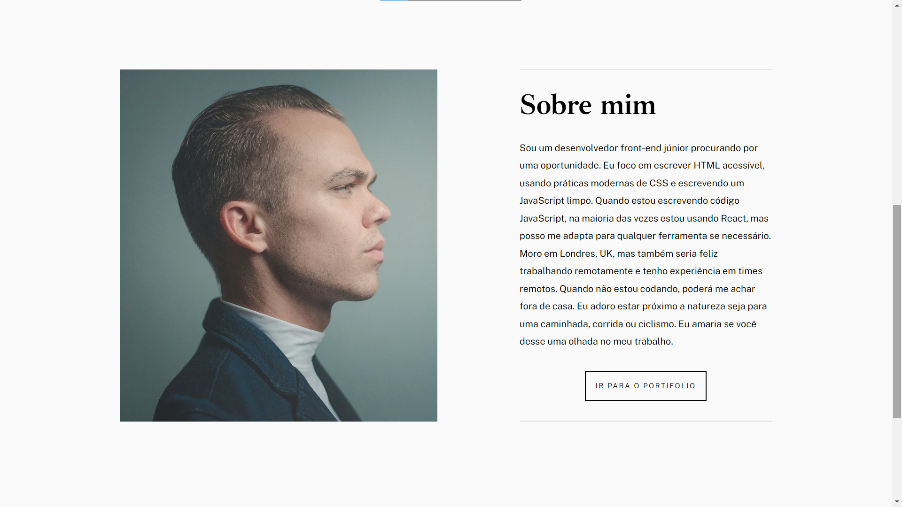
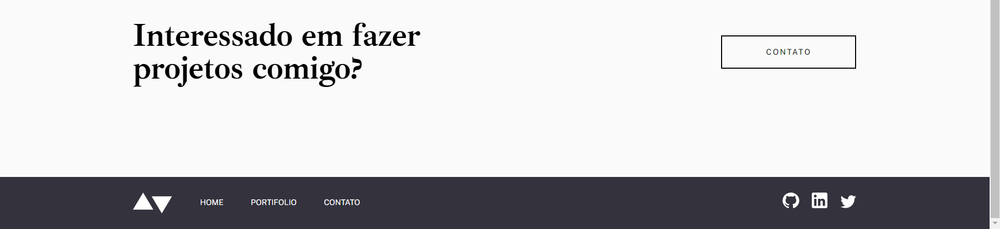

# Exemple portfolio

* Projeto feito apenas com HTML e CSS durante o primeiro módulo do curso Cubos Academy!
# Preview

# link 

>Press CTRL + click to open in new tab

https://ronalt4cs.github.io/Exemple-portfolio/
